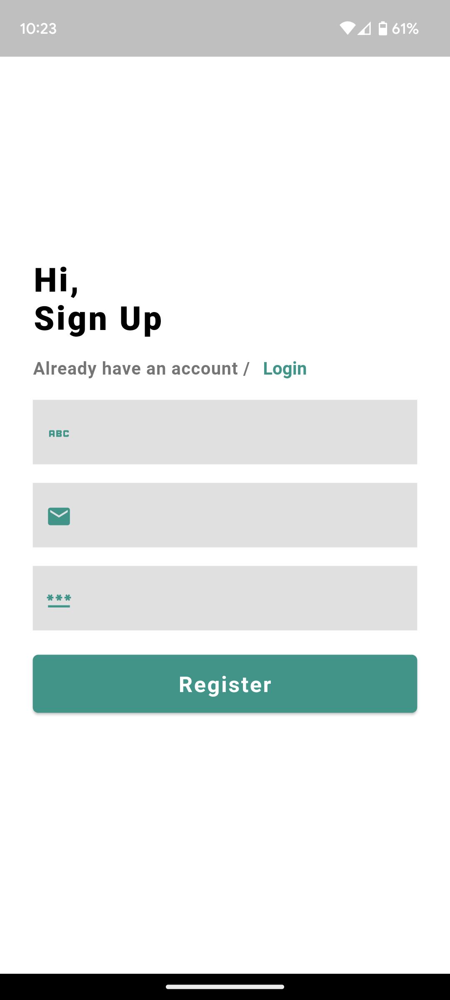
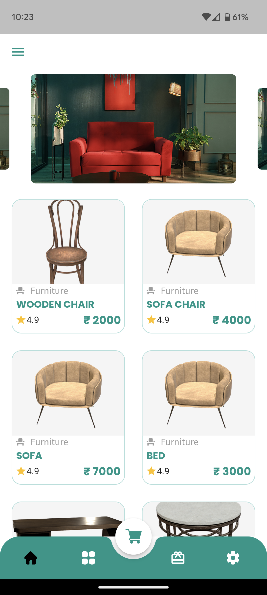
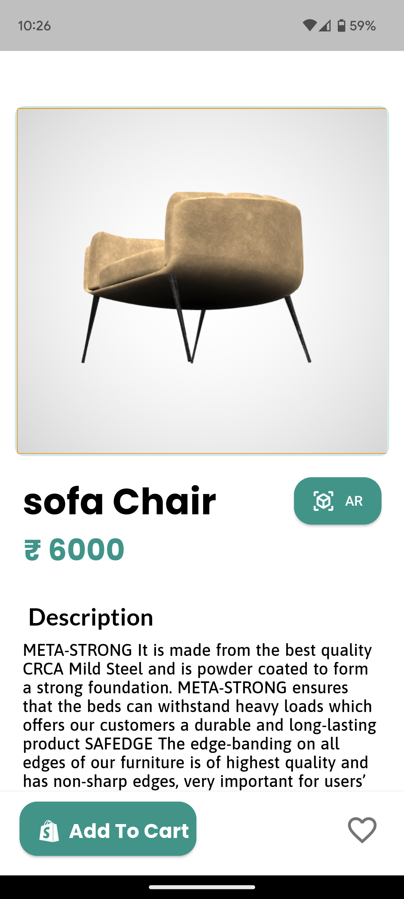

# AR Furniture App

Flutter project.

#### How to get started?

###### Download the project from Repo

```
git clone https://github.com/NesanSelvan/Ar-furniture-v1
```

```dart
cd task_management
flutter pub get
flutter run
```
## Outputs

### AR Screen

https://user-images.githubusercontent.com/88973192/235292701-fc7bbed1-3682-4608-afa3-cc063f5b8d93.mp4


### LOGIN 
<table>
  <tr>
    <td>login page</td>
     <td>sign up page</td>
  </tr>
  <tr>
    <td></td>
    <td></td>
  </tr>
 </table>
  
<table>
  <tr>
    <td>home page</td>
     <td>product page</td>
  </tr>
  <tr>
    <td></td>
    <td></td>
  </tr>
 </table>
